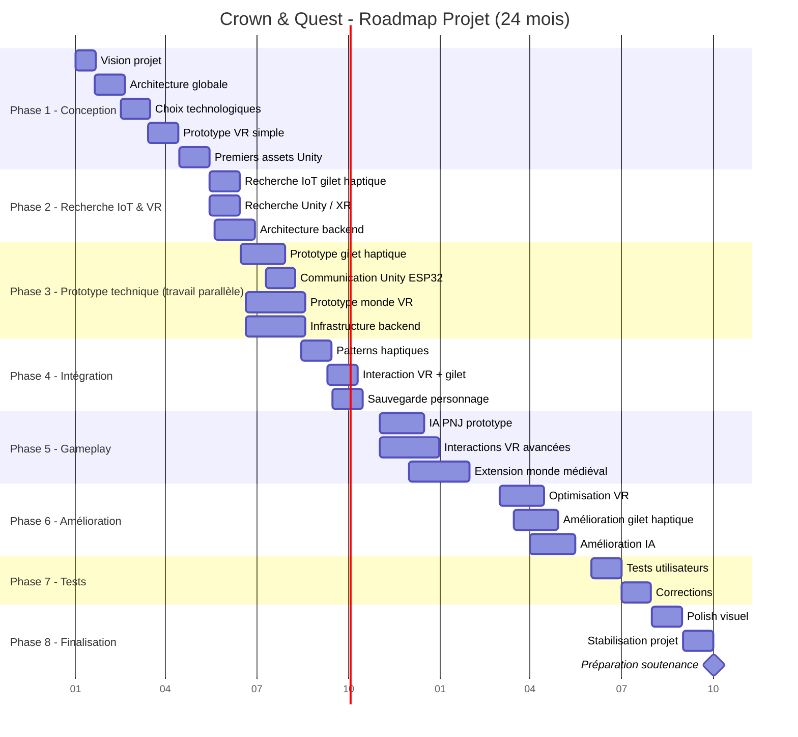

```mermaid
gantt
title Crown & Quest - Roadmap Projet (24 mois)
dateFormat YYYY-MM-DD
axisFormat %m

section Phase 1 - Conception
Vision projet :p1a, 2026-01-01, 20d
Architecture globale :p1b, 2026-01-20, 30d
Choix technologiques :p1c, 2026-02-15, 30d
Prototype VR simple :p1d, 2026-03-15, 30d
Premiers assets Unity :p1e, 2026-04-15, 30d

section Phase 2 - Recherche IoT & VR
Recherche IoT gilet haptique :p2a, 2026-05-15, 30d
Recherche Unity / XR :p2b, 2026-05-15, 30d
Architecture backend :p2c, 2026-05-20, 40d

section Phase 3 - Prototype technique (travail parallèle)
Prototype gilet haptique :p3a, 2026-06-15, 45d
Communication Unity ESP32 :p3b, 2026-07-10, 30d
Prototype monde VR :p3c, 2026-06-20, 60d
Infrastructure backend :p3d, 2026-06-20, 60d

section Phase 4 - Intégration
Patterns haptiques :p4a, 2026-08-15, 30d
Interaction VR + gilet :p4b, 2026-09-10, 30d
Sauvegarde personnage :p4c, 2026-09-15, 30d

section Phase 5 - Gameplay
IA PNJ prototype :p5a, 2026-11-01, 45d
Interactions VR avancées :p5b, 2026-11-01, 60d
Extension monde médiéval :p5c, 2026-12-01, 60d

section Phase 6 - Amélioration
Optimisation VR :p6a, 2027-03-01, 45d
Amélioration gilet haptique :p6b, 2027-03-15, 45d
Amélioration IA :p6c, 2027-04-01, 45d

section Phase 7 - Tests
Tests utilisateurs :p7a, 2027-06-01, 30d
Corrections :p7b, 2027-07-01, 30d

section Phase 8 - Finalisation
Polish visuel :p8a, 2027-08-01, 30d
Stabilisation projet :p8b, 2027-09-01, 30d
Préparation soutenance :milestone, 2027-10-01, 1d
```