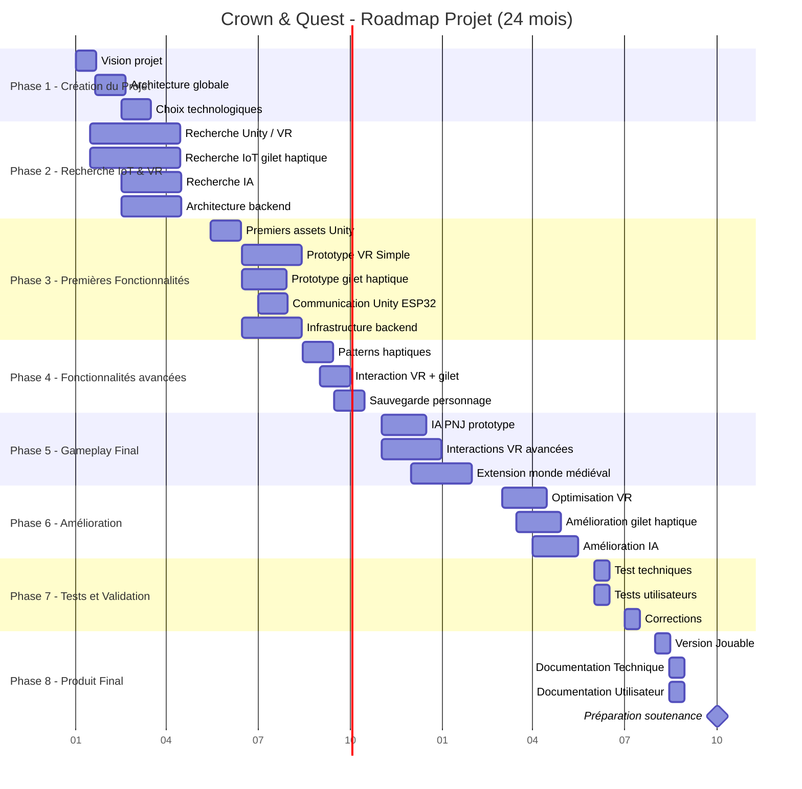

```mermaid
gantt
title Crown & Quest - Roadmap Projet (24 mois)
dateFormat YYYY-MM-DD
axisFormat %m

section Phase 1 - Création du Projet
Vision projet :p1a, 2026-01-01, 20d
Architecture globale :p1b, 2026-01-20, 30d
Choix technologiques :p1c, 2026-02-15, 30d

section Phase 2 - Recherche IoT & VR
Recherche Unity / VR :p2a, 2026-01-15, 90d
Recherche IoT gilet haptique :p2b, 2026-01-15, 90d
Recherche IA :p2c, 2026-02-15, 60d
Architecture backend :p2d, 2026-02-15, 60d

section Phase 3 - Premières Fonctionnalités
Premiers assets Unity :p3a, 2026-5-15, 30d
Prototype VR Simple :p3b, 2026-06-15, 60d
Prototype gilet haptique :p3c, 2026-06-15, 45d
Communication Unity ESP32 :p3d, 2026-07-01, 30d
Infrastructure backend :p3e, 2026-06-15, 60d

section Phase 4 - Fonctionnalités avancées
Patterns haptiques :p4a, 2026-08-15, 30d
Interaction VR + gilet :p4b, 2026-09-01, 30d
Sauvegarde personnage :p4c, 2026-09-15, 30d

section Phase 5 - Gameplay Final
IA PNJ prototype :p5a, 2026-11-01, 45d
Interactions VR avancées :p5b, 2026-11-01, 60d
Extension monde médiéval :p5c, 2026-12-01, 60d

section Phase 6 - Amélioration
Optimisation VR :p6a, 2027-03-01, 45d
Amélioration gilet haptique :p6b, 2027-03-15, 45d
Amélioration IA :p6c, 2027-04-01, 45d

section Phase 7 - Tests et Validation
Test techniques: p7a,2027-06-01, 15d
Tests utilisateurs :p7b, 2027-06-01, 15d
Corrections :p7c, 2027-07-01, 15d

section Phase 8 - Produit Final
Version Jouable :p8a, 2027-08-01, 15d
Documentation Technique :p8b, 2027-08-15, 15d
Documentation Utilisateur :p8c, 2027-08-15, 15d
Préparation soutenance :milestone, 2027-10-01, 1d
```