```mermaid
%%{init: {'flowchart': {'curve': 'stepBefore', 'nodeSpacing': 45, 'rankSpacing': 70}}}%%
flowchart LR

A[Crown & Quest]

A --> B
A --> C
A --> D
A --> E
A --> F
A --> G
A --> H

subgraph SH[Produit final]
direction LR
H[Produit final] --> H1[Version jouable]
H --> H2[Système haptique]
H --> H3[Documentation finale]

H1 --> H11[Build de la simulation VR]
H2 --> H21[Plastron fonctionnel]
H3 --> H31[Documentation technique]
H3 --> H32[Documentation utilisateur]
end

subgraph SG[Tests et validation]
direction LR
G[Tests et validation] --> G1[Tests techniques]
G --> G2[Tests gameplay]
G --> G3[Rapports et validation]

G1 --> G11[Rapport de tests VR]
G1 --> G12[Rapport de tests du plastron]
G1 --> G13[Rapport de tests de communication]

G2 --> G21[Rapport d’équilibrage]
G2 --> G22[Rapport de tests utilisateurs]
end

subgraph SF[Contenu du jeu]
direction LR
F[Contenu du jeu] --> F1[Environnements]
F --> F2[Personnages]
F --> F3[Objets]
F --> F4[Audio]

F1 --> F11[Modèles 3D des environnements]
F1 --> F12[Textures environnementales]

F2 --> F21[Modèle avatar]
F2 --> F22[Modèles PNJ]
F2 --> F23[Animations personnages]

F3 --> F31[Modèles d’armes]
F3 --> F32[Objets interactifs]

F4 --> F41[Musiques]
F4 --> F42[Effets sonores]
F4 --> F43[Feedback audio]
end

subgraph SE[Plastron haptique]
direction LR
E[Plastron haptique] --> E1[Prototype matériel]
E --> E2[Firmware du plastron]
E --> E3[Interface de communication]
E --> E4[Système de feedback haptique]

E1 --> E11[Prototype du plastron]
E1 --> E12[Circuit électronique]
E1 --> E13[Intégration des actionneurs haptiques]

E2 --> E21[Firmware du microcontrôleur]
E2 --> E22[Gestion des moteurs haptiques]
E2 --> E23[Gestion des capteurs]

E3 --> E31[Protocole de communication]
E3 --> E32[Interface logicielle jeu ↔ plastron]

E4 --> E41[Mapping des zones haptiques]
E4 --> E42[Système de déclenchement des vibrations]
E4 --> E43[Paramétrage intensité / durée]
end

subgraph SD[VR]
direction LR
D[VR] --> D1[Intégration VR]
D --> D2[Interaction VR]
D --> D3[Confort utilisateur]

D1 --> D11[Intégration du SDK VR]
D1 --> D12[Gestion du casque VR]
D1 --> D13[Gestion des contrôleurs VR]

D2 --> D21[Système de manipulation d’objets]
D2 --> D22[Système de détection des mains]
D2 --> D23[Système d’interaction physique]

D3 --> D31[Système de locomotion]
D3 --> D32[Calibration joueur]
D3 --> D33[Réduction du motion sickness]
end

subgraph SC[Simulation]
direction LR
C[Simulation] --> C1[Prototype jouable]
C --> C2[Système joueur]
C --> C3[Système de gameplay]
C --> C4[Système d’interaction]
C --> C5[Intelligence artificielle]
C --> C6[Interface utilisateur]

C1 --> C11[Prototype de déplacement utilisateur]
C1 --> C12[Prototype d’interaction VR]
C1 --> C13[Système de détection des collisions]

C2 --> C21[Système de déplacement]
C2 --> C22[Système de contrôle VR]
C2 --> C23[Système de caméra VR]

C3 --> C31[Système de dialogue]
C3 --> C32[Système de combat]

C4 --> C41[Interaction avec objets]
C4 --> C42[Système de ramassage d’objets]
C4 --> C43[Utilisation d’objets]

C5 --> C54[Système de dialogue]
C5 --> C55[Système d’arbre de décision]

C6 --> C61[HUD]
C6 --> C62[Menus du jeu]
C6 --> C63[Feedback visuel]
end

subgraph SB[Gestion de projet]
direction LR
B[Gestion de projet] --> B1[Documentation projet]
B --> B2[Outils et infrastructure]

B1 --> B11[Cahier des charges]
B1 --> B12[Game Design Document]
B1 --> B13[Technical Design Document]
B1 --> B14[Planning du projet]
B1 --> B15[Analyse des risques]

B2 --> B21[Repository Git configuré]
B2 --> B22[Outils de gestion de projet]
B2 --> B23[Environnement de développement]
end

```

# Crown & Quest —  WBS

---

---

## 0. Introduction

### 0.1 Contexte du projet
Le projet consiste à développer une simulation immersive de type médiéval fantastique en réalité virtuelle (VR).
L'utilisateur incarne un personnage évoluant dans un environnement interactif et réaliste.

La simulation est couplée à un plastron haptique, permettant de retranscrire physiquement certains événements, notamment les impacts reçus par l'utilisateur.
Ce système vise à renforcer l’immersion en synchronisant les événements virtuels avec des sensations physiques.

### 0.2 Objectifs du document
Ce document décrit :
- les fonctionnalités attendues du système
- les exigences techniques associées
- les interactions entre les différents composants

Il sert de référence pour faciliter l’implémentation et la validation du projet.

### 0.3 Description globale du système
Le système se compose de trois éléments principaux :
1. la simulation VR
2. le système d’interaction VR
3. le plastron haptique

Le jeu gère la logique de gameplay et les interactions.
Le système VR permet l’immersion et les interactions physiques.
Le plastron haptique traduit certains événements du jeu en sensations physiques.

---

## 1. Gestion de projet

### 1.1 Documentation projet
Afin de bien définir les exigences techniques du projet, il sera nécessaire de produire puis de faire évoluer :
- un cahier des charges, extension de ce document.
- un Game Design Document (GDD) décrivant avec précision tous les aspect interactifs, narratifs et interactif de la simulation.
- un Technical Design Document décrivant les aspects techniques de la simulation, les technologies et les interactions entre composants.

Afin de plannifier efficacement et de suivre le développement du projet, devront être produits aussi :
- un planning du projet sous la forme d’un diagramme de Gantt.
- une analyse précise des risques et des points possiblement bloquants.
      
### 1.2 Outils et infrastructure
Pour optimiser le travail d’équipe, faciliter la communciation et simplifier le travail des développeurs, il sera nécessaire de mettre en place :
- un outil de Version Control (Git, …) à la fois pour le code source du projet mais aussi pour la documentation.
- un outil de gestion de projet de type ticketing (Jira, …) afin de plannifer et assigner les tâches.
- un environnement de développement commun (Logiciels, configurations).

---

## 2. Fonctionnalités de la simulation

### 2.1 Prototype jouable
Le système doit fournir un prototype permettant de tester les mécaniques principales :
- l'utilisateur doit pouvoir se déplacer dans l’environnement.
- l'utilisateur doit pouvoir interagir avec des objets.

### 2.2 Système joueur
La simulation doit gérer le comportement de l'utilisateur :
- la gestion des déplacements.
- la gestion de la position dans l’environnement.
- la gestion de la caméra VR.

*Exigences*
- les mouvements d'utilisateur doivent être synchronisés avec les mouvements du casque VR.
- les déplacements doivent rester confortables en VR.

### 2.3 Système de gameplay
La simulation doit implémenter les mécaniques principales.
- Dialogues
Le système de dialogues doit permettre :
  - d’intéragir avec n’importe quel personnage non joueur (PNJ).
  - de choisir parmis une liste de possibilité.
  - d’obtenir une réponse dépendante du choix de l'utilisateur et de la personnalité du PNJ.
- Combat
Le système de combat doit permettre :
  - d’attaquer des adversaires.
  - de détecter les collisions entre armes et adversaires.
  - de calculer les dégâts.

### 2.4 Système d’interaction
L'utilisateur doit pouvoir interagir avec des éléments du monde :
- ramasser des objets.
- manipuler des objets.
- utiliser des objets.

### 2.5 Intelligence artificielle
Les PNJ doivent être contrôlés par un système d’intelligence artificielle :
- détection de l'utilisateur.
- dialogues avec l'utilisateur.
- arbres de décisions de dialogues.

### 2.6 Interface utilisateur
Le système doit fournir une interface utilisateur adaptée à la VR :
- affichage du HUD.
- affichage des menus.
- feedback visuel lors des actions.

---

## 3. Fonctionnalités VR

### 3.1 Intégration VR
Le système doit être compatible avec un casque VR et permettre :
- la gestion du suivi de position du casque.
- la gestion des contrôleurs VR.
- la synchronisation des mouvements.

### 3.2 Interaction VR
L'utilisateur doit pouvoir interagir physiquement avec le monde virtuel et :
- saisir des objets.
- manipuler des objets.
- détecter des mouvements.

### 3.3 Confort utilisateur
Le système doit limiter les effets de motion sickness grâce à :
- un framerate stable.
- des mouvements fluides.
- la calibration de l'utilisateur.

---

## 4. Plastron haptique

### 4.1 Prototype matériel
Un prototype de plastron haptique doit être développé avec :
- l’intégration d’actionneurs haptiques.
- la programmation de circuit électronique de contrôle.

### 4.2 Firmware du plastron
Le plastron doit être piloté par un microcontrôleur responsable :
- du contrôle des moteurs haptiques.
- de la gestion des entrées/sorties.
- de la réception des commandes.

### 4.3 Communication avec La simulation
Le plastron doit pouvoir recevoir des événements provenant de la simulation :
- par un protocole de communication défini.
- par la transmission des événements de combat.
- avec une latence minimale.

### 4.4 Feedback haptique
Le système doit produire des sensations physiques correspondant aux événements de la simulation :
- des vibrations lors des impacts.
- des variations d’intensité selon les dégâts.
- l’activation des zones correspondantes du plastron.

---

## 5. Contenu de la simulation
5.1 Environnements
la simulation doit inclure des environnements médiévaux fantastiques :
- des modèles 3D.
- des textures réalistes.
- des éléments interactifs.

### 5.2 Personnages
Le système doit inclure :
- un modèle de l'avatar.
- des modèles de PNJ.
- des animations associées.

### 5.3 Objets
la simulation doit inclure des objets interactifs comme :
- des armes.
- des objets manipulables.

### 5.4 Audio
Le système doit intégrer :
- des musiques.
- des effets sonores.
- des feedback audio.

---

## 6. Tests et validation

### 6.1 Tests techniques
Les tests doivent vérifier :
- le fonctionnement VR.
- la communication avec le plastron.
- la stabilité de la simulation.

### 6.2 Tests gameplay
Les tests doivent évaluer :
- l’équilibrage.
- la jouabilité.
- l’immersion.

---

## 7. Produit final

### 7.1-2 Version jouable
Le produit final doit inclure :
- une version jouable de la simulation.
- un plastron haptique fonctionnel.

### 7.3 Documentation
Il sera aussi fourni avec le produit :
- la documentation technique.
- la documentation utilisateur.
